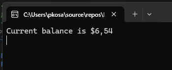
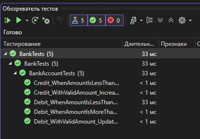

# Практическая работа №6: Unit-тестирование (часть 1)

## Цель работы
Провести тестирование методов класса BankAccount с использованием MSTest.

## Результаты

### Консольное приложение Bank

### Обозреватель тестов

## Описание тестов

1. **Debit_WithValidAmount_UpdatesBalance** – проверяет корректное уменьшение баланса при снятии допустимой суммы.
   - *Первый запуск:* провален, потому что в методе Debit использовалось сложение вместо вычитания.
   - *После исправления:* тест пройден.

2. **Debit_WhenAmountIsLessThanZero_ShouldThrowArgumentOutOfRange** – проверяет выброс исключения при попытке снять отрицательную сумму.
   - После рефакторинга добавлена проверка сообщения исключения.

3. **Debit_WhenAmountIsMoreThanBalance_ShouldThrowArgumentOutOfRange** – проверяет выброс исключения при превышении баланса.

4. **Credit_WithValidAmount_IncreasesBalance** – проверяет увеличение баланса при пополнении.

5. **Credit_WhenAmountIsLessThanZero_ShouldThrowArgumentOutOfRange** – проверяет исключение при отрицательной сумме пополнения.

## Выводы
- Модульные тесты помогают быстро находить логические ошибки (например, неверный оператор в Debit).
- Использование XML-комментариев улучшает читаемость кода и подсказки IntelliSense.
- Проверка сообщений исключений делает тесты более надёжными и информативными.
